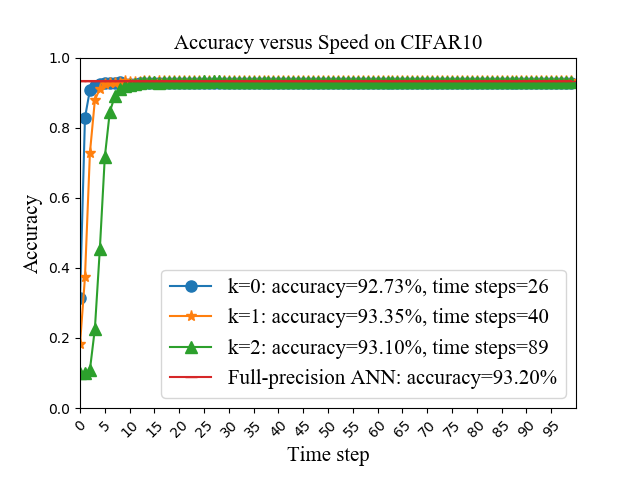

# Instructions for running CIFAR10 experiments


## File overview:

- `README_CIFAR10.md` - this readme file for CIFAR10.<br>
- `spiking_ulils.py` - the functions of spiking convolution and linear.<br>
- `figs` - visualization folder for SNN performance.<br>
  - `accuracy_speed.py` - the accuracy versus speed script for `spiking CNN 1` and `spiking CNN 2` with different quantization precisions on CIFAR10.<br>
  - `sops.py` - the computing operations script for `spiking CNN 1` and `spiking CNN 2` with different quantization precisions on CIFAR10.
  - `sparsity.py` - the spike sparsity script for `spiking CNN 1` and `spiking CNN 2` with different quantization precisions on CIFAR10.<br>
- `CNN_1` - CNN 1 for CIFAR10.<br>
  - `tensorlayer` - our provided tensorlayer package.<br>
  - `training_k0_cnn1_CIFAR10.py` - the training script for `CNN 1` with quantization precision *`k=0`* on CIFAR10.<br>
  - `training_k1_cnn1_CIFAR10.py` - the training script for `CNN 1` with quantization precision *`k=1`* on CIFAR10..<br>
  - `training_k2_cnn1_CIFAR10.py` - the training script for `CNN 1` with quantization precision *`k=2`* on CIFAR10.<br>
  - `inference_k0_cnn1_CIFAR10.py` - the evaluation script for `CNN 1` with quantization precision *`k=0`* on CIFAR10.<br>
  - `inference_k1_cnn1_CIFAR10.py` - the evaluation script for `CNN 1` with quantization precision *`k=1`* on CIFAR10.<br>
  - `inference_k2_cnn1_CIFAR10.py` - the evaluation script for `CNN 1` with quantization precision *`k=2`* on CIFAR10.<br>
  - `inference_k0_scnn1_CIFAR10.py` - the evaluation script for `spiking CNN 1` with quantization precision *`k=0`* on CIFAR10.<br>
  - `inference_k1_scnn1_CIFAR10.py` - the evaluation script for `spiking CNN 1` with quantization precision *`k=1`* on CIFAR10.<br>
  - `inference_k2_scnn1_CIFAR10.py` - the evaluation script for `spiking CNN 1` with quantization precision *`k=2`* on CIFAR10.<br>
  - `training_full_cnn1_CIFAR10.py` - the training script for `CNN 1` with `full precision (float32)` on CIFAR10.<br>
  - `inference_full_cnn1_CIFAR10.py` - the evaluation script for `CNN 1` with `full precision (float32)` on CIFAR10.<br>

- `CNN_2` - CNN 2 for CIFAR10.<br>
  - `tensorlayer` - our provided tensorlayer package.<br>
  - `training_k0_cnn2_CIFAR10.py` - the training script for `CNN 2` with quantization precision *`k=0`* on CIFAR10.<br>
  - `training_k1_cnn2_CIFAR10.py` - the training script for `CNN 2` with quantization precision *`k=1`* on CIFAR10..<br>
  - `training_k2_cnn2_CIFAR10.py` - the training script for `CNN 2` with quantization precision *`k=2`* on CIFAR10.<br>
  - `inference_k0_cnn2_CIFAR10.py` - the evaluation script for `CNN 2` with quantization precision *`k=0`* on CIFAR10.<br>
  - `inference_k1_cnn2_CIFAR10.py` - the evaluation script for `CNN 2` with quantization precision *`k=1`* on CIFAR10.<br>
  - `inference_k2_cnn2_CIFAR10.py` - the evaluation script for `CNN 2` with quantization precision *`k=2`* on CIFAR10.<br>
  - `inference_k0_scnn2_CIFAR10.py` - the evaluation script for `spiking CNN 2` with quantization precision *`k=0`* on CIFAR10.<br>
  - `inference_k1_scnn2_CIFAR10.py` - the evaluation script for `spiking CNN 2` with quantization precision *`k=1`* on CIFAR10.<br>
  - `inference_k2_scnn2_CIFAR10.py` - the evaluation script for `spiking CNN 2` with quantization precision *`k=2`* on CIFAR10.<br>
  - `training_full_cnn2_CIFAR10.py` - the training script for `CNN 2` with `full precision (float32)` on CIFAR10.<br>
  - `inference_full_cnn2_CIFAR10.py` - the evaluation script for `CNN 2` with `full precision (float32)` on CIFAR10.<br>  


## ANN Training
### Before running
* Please note your default dataset folder will be `./data`

* please modify the `resume=True`, and `learning_rate=0.0001` in the training scripts for another 100 epochs after the first 100 epochs. Totally, 200 training epoch need be performed.  

### Run the code
**for example**:
```sh
$ python training_k0_cnn1_CIFAR10.py
```
manually set `resume=True, learning_rate=0.0001` in `training_k0_cnn1_CIFAR10.py`, then run it once again:
```sh
$ python training_k0_cnn1_CIFAR10.py
```
finally, it will generate the corresponding model files including: `checkpoint`, `model_CIFAR10_advanced.ckpt.data-00000-of-00001`, `model_CIFAR10_advanced.ckpt.index`, `model_CIFAR10_advanced.ckpt.meta` and `model_cifar_10.npz`.

## ANN Inference
### Run the code
for example:
```sh
$ python inference_k0_cnn1_CIFAR10.py
```
Then, it will print the corresponding ANN test accuracy.

## SNN inference
### Run the code
for example:
```sh
$ python inference_k0_scnn1_CIFAR10.py
```
Then, it will generate the corresponding log files including: `accuracy.txt`, `sop_num.txt`, `spike_collect.txt` and `spike_num.txt`.

## Visualization

for example:
```sh
$ move SNN_accuracy.txt ./figs
$ python accuracy_speed.py
```
Then, it will show the visualization results for SNN.

## Results
Our proposed method achieves the following performance on :

### CIFAR10
| Quantization Level  | Network Size  | Epochs | ANN | SNN | Time Steps |
| ------------------ |---------------- | -------------- | ------------- | ------------- | ------------- |
| full-precision | 96C3-256C3-P2-384C3-P2-384C3-256C3-P2-1024-1024 | 200 | 92.66% | N/A | N/A |
| k=1 | 96C3-256C3-P2-384C3-P2-384C3-256C3-P2-1024-1024 | 200 | 92.77% | 92.77% |  57 |
| full-precision | 128C3-256C3-P2-512C3-P2-1024C3-512C3-P2-1024-512 | 200 | 93.20% | N/A | N/A |
| k=1 | 128C3-256C3-P2-512C3-P2-1024C3-512C3-P2-1024-512 | 200 |  93.35% | 93.35% | 40 |

### Accuracy versus speed
CNN 1: 96C3-256C3-P2-384C3-P2-384C3-256C3-1024-1024<br>
CNN 2: 128C3-256C3-P2-512C3-P2-1024C3-512C3-1024-512
<figure class="half">
    
    
</figure>

### Firing sparsity
CNN 1 and CNN 2
<figure class="half">
    
    
</figure>

### Computing operations
CNN 1 and CNN 2
<figure class="half">
    
    
</figure>

## Notes
* We do not consider the synaptic operations in the input encoding layer and the spike outputs in the last classification layer (membrane potential accumulation instead) for both original ANN counterparts and converted SNNs.<br>
* We also provide some scripts for visualization in ./figs, please move `SNN_accuracy.txt`, `sop_num.txt`, `spike_collect.txt` and `spike_num.txt` to this folder and directly run the scripts.

## More question:<br>
- There might be a little difference of results for multiple training repetitions, because of the randomization. 
- Please feel free to reach out here or email: xxx@xxx, if you have any questions or difficulties. I'm happy to help guide you.
