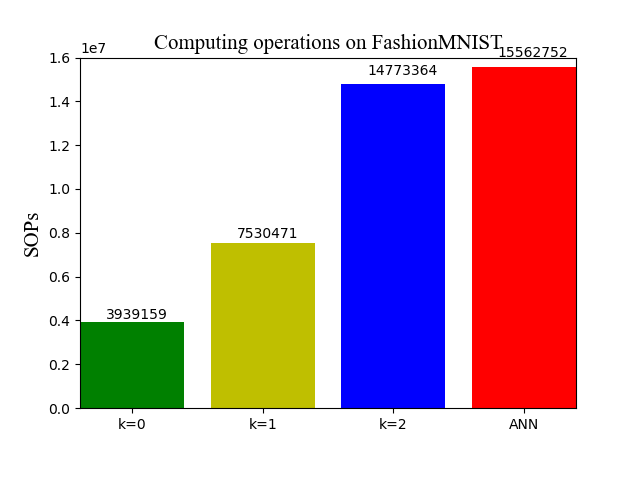

# Instructions for running FashionMNIST experiments


## File overview:

- `README_FashionMNIST.md` - this readme file for FashionMNIST.<br>
- `LeNet` - LeNet for FashionMNIST.<br>
  - `tensorlayer` - our provided tensorlayer package.<br>
  - `Quant_LeNet_FashionMNIST.py` - the training script for `LeNet` with optional quantization precision *`k`* on FashionMNIST.<br>
  - `Spiking_LeNet_FashionMNIST.py` - the evaluation script for `spiking LeNet` with optional quantization precision *`k`* on FashionMNIST.<br>
  - `FP32_LeNet_FashionMNIST.py` - the training script for `LeNet` with `full precision (float32)` on FashionMNIST.<br>
  - `spiking_ulils.py` - the functions of spiking convolution and linear.<br>
  - `figs` - visualization folder for SNN performance.<br>
    - `accuracy_speed.py` - the accuracy versus speed script for `spiking LeNet` with different quantization precisions on FashionMNIST.<br>
    - `sops.py` - the computing operations script for `spiking LeNet` with different quantization precisions on FashionMNIST.
    - `sparsity.py` - the spike sparsity script for `spiking LeNet` with different quantization precisions on FashionMNIST.<br>

- `MLP` - MLP for FashionMNIST.<br>
  - `tensorlayer` - our provided tensorlayer package.<br>
  - `Quant_MLP_FashionMNIST.py` - the training script for `MLP` with optional quantization precision *`k`* on FashionMNIST.<br>
  - `Spiking_MLP_FashionMNIST.py` - the evaluation script for `spiking MLP` with optional quantization precision *`k`* on FashionMNIST.<br>
  - `FP32_MLP_FashionMNIST.py` - the training script for `MLP` with `full precision (float32)` on FashionMNIST.<br>
  - `spiking_ulils.py` - the functions of spiking convolution and linear.<br>
  - `figs` - visualization folder for SNN performance.<br>
    - `accuracy_speed.py` - the accuracy versus speed script for `spiking MLP` with different quantization precisions on FashionMNIST.<br>
    - `sops.py` - the computing operations script for `spiking MLP` with different quantization precisions on FashionMNIST.
    - `sparsity.py` - the spike sparsity script for `spiking MLP` with different quantization precisions on FashionMNIST.<br>


## ANN Training
### **Before running**:
* Please note your default dataset folder will be `./data`

### **Run the code**:
for example (training, *k=0*, LeNet, FashionMNIST):
```sh
$ python Quant_LeNet_FashionMNIST.py --k 0 --resume False --mode 'training'
```
finally, it will generate the corresponding model files including: `checkpoint`, `model_fashion_mnist_advanced.ckpt.data-00000-of-00001`, `model_fashion_mnist_advanced.ckpt.index`, `model_fashion_mnist_advanced.ckpt.meta` and `model_fashion_mnist.npz`.

## ANN Inference
### **Run the code**:
for example ((inference, *k=0*, LeNet, FashionMNIST)):
```sh
$ python Quant_LeNet_FashionMNIST.py --k 0 --resume True --mode 'inference'
```
Then, it will print the corresponding ANN test accuracy.

## SNN inference
### **Run the code**:
for example (inference, *k=0*, spiking LeNet, FashionMNIST):
```sh
$ python $ python Spiking_LeNet_FashionMNIST.py --k 0
```
Then, it will generate the corresponding log files including: `accuracy.txt`, `sop_num.txt`, `spike_collect.txt` and `spike_num.txt` in `figs/k0/`.

## Visualization

### **Accuracy versus speed**:
```sh
$ cd figs
$ python accuracy_speed.py
```
### **Firing sparsity**:
```sh
$ python sparsity.py
```
### **Computing operations**:
```sh
$ python sops.py
```

## Results
Our proposed spiking LeNet and MLP achieve the following performances on FashionMNIST:

MLP: 400-400<br>
LeNet: 32C5-P2-64C5-P2-1024

### **Accuracy versus speed**:

<figure class="half">
    
</figure>

### **Firing sparsity**:
<figure class="half">
    
</figure>

### **Computing operations**:
<figure class="half">
    
</figure>

## Notes
* We do not consider the synaptic operations in the input encoding layer and the spike outputs in the last classification layer (membrane potential accumulation instead) for both original ANN counterparts and converted SNNs.<br>
* We also provide some scripts for visualization in ./figs, please move `SNN_accuracy.txt`, `sop_num.txt`, `spike_collect.txt` and `spike_num.txt` to this folder and directly run the scripts.

## More question:<br>
- There might be a little difference of results for multiple training repetitions, because of the randomization. 
- Please feel free to reach out here or email: xxx@xxx, if you have any questions or difficulties. I'm happy to help guide you.
