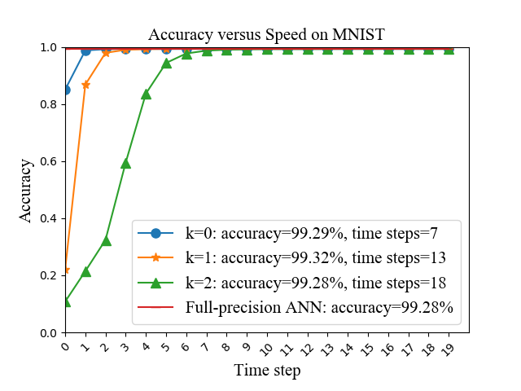
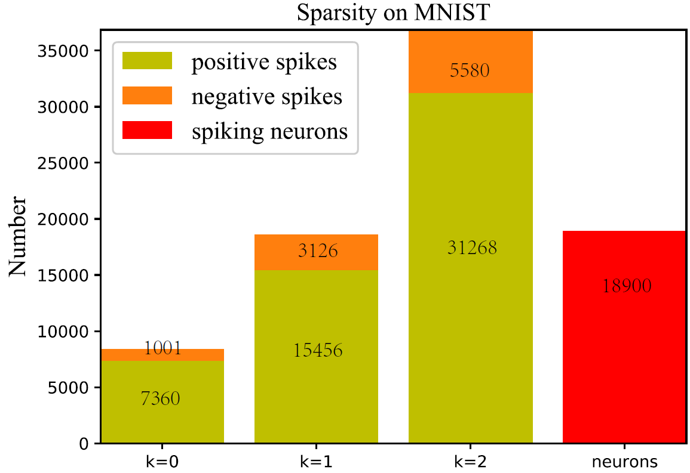
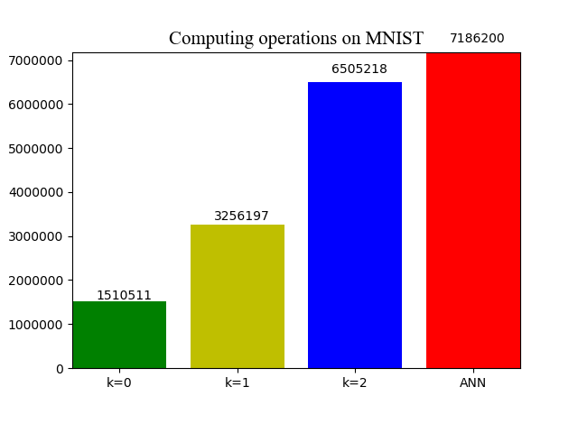

# Instructions for running MNIST experiments


## File overview:

- `README_MNIST.md` - this readme file for MNIST.<br>
- `spiking_ulils.py` - the functions of spiking convolution and linear.<br>
- `figs` - visualization folder for SNN performance.<br>
  - `accuracy_speed.py` - the accuracy versus speed script for `spiking LeNet` with different quantization precisions on MNIST<br>
  - `sops.py` - the computing operations script for `spiking LeNet` with different quantization precisions on MNIST
  - `sparsity.py` - the spike sparsity script for `spiking LeNet` with different quantization precisions on MNIST<br>
- `LeNet` - LeNet for MNIST.<br>
  - `tensorlayer` - our provided tensorlayer package.<br>
  - `training_k0_lenet_MNIST.py` - the training script for `LeNet` with quantization precision *`k=0`* on MNIST<br>
  - `training_k1_lenet_MNIST.py` - the training script for `LeNet` with quantization precision *`k=1`* on MNIST.<br>
  - `training_k2_lenet_MNIST.py` - the training script for `LeNet` with quantization precision *`k=2`* on MNIST<br>
  - `inference_k0_lenet_MNIST.py` - the evaluation script for `LeNet` with quantization precision *`k=0`* on MNIST<br>
  - `inference_k1_lenet_MNIST.py` - the evaluation script for `LeNet` with quantization precision *`k=1`* on MNIST<br>
  - `inference_k2_lenet_MNIST.py` - the evaluation script for `LeNet` with quantization precision *`k=2`* on MNIST<br>
  - `inference_k0_slenet_MNIST.py` - the evaluation script for `spiking LeNet` with quantization precision *`k=0`* on MNIST<br>
  - `inference_k1_slenet_MNIST.py` - the evaluation script for `spiking LeNet` with quantization precision *`k=1`* on MNIST<br>
  - `inference_k2_slenet_MNIST.py` - the evaluation script for `spiking LeNet` with quantization precision *`k=2`* on MNIST<br>
  - `training_full_lenet_MNIST.py` - the training script for `LeNet` with `full precision (float32)` on MNIST<br>
  - `inference_full_lenet_MNIST.py` - the evaluation script for `LeNet` with `full precision (float32)` on MNIST<br>


## ANN Training
### Before running
* Please note your default dataset folder will be ./data [data](https://github.com/stonezwr/TSSL-BP/tree/master/Networks)

### Run the code
for example:
```sh
$ python training_k0_lenet_MNIST.py
```
finally, it will generate the corresponding model files including: `checkpoint`, `model_MNIST_advanced.ckpt.data-00000-of-00001`, `model_MNIST_advanced.ckpt.index`, `model_MNIST_advanced.ckpt.meta` and `model_MNIST.npz`.

## ANN Inference
### Run the code
for example:
```sh
$ python inference_k0_lenet_MNIST.py
```
Then, it will print the corresponding ANN test accuracy.

## SNN inference
### Run the code
for example:
```sh
$ python inference_k0_slenet_MNIST.py
```
Then, it will generate the corresponding log files including: `accuracy.txt`, `sop_num.txt`, `spike_collect.txt` and `spike_num.txt`.

## Visualization

for example:
```sh
$ move SNN_accuracy.txt ./figs
$ python accuracy_speed.py
```
Then, it will show the visualization results for SNN.

## Results
Our proposed method achieves the following performance on :

### MNIST
| Quantization Level  | Network Size  | Epochs | ANN | SNN | Time Steps |
| ------------------ |---------------- | -------------- | ------------- | ------------- | ------------- |
| Full-precision | 20C5-P2-50C5-P2-500 |   150   |  99.28% | N/A | N/A |
| k=1 | 20C5-P2-50C5-P2-500 |   150   |  99.32% | 99.32% |  13 |

### Accuracy versus speed
LeNet: 20C5-P2-50C5-P2-500


<div style='display: none'>


</div>

### Firing sparsity
LeNet


### Computing operations
MLP and LeNet


## Notes
* We do not consider the synaptic operations in the input encoding layer and the spike outputs in the last classification layer (membrane potential accumulation instead) for both original ANN counterparts and converted SNNs.<br>
* We also provide some scripts for visualization in ./figs, please move `SNN_accuracy.txt`, `sop_num.txt`, `spike_collect.txt` and `spike_num.txt` to this folder and directly run the scripts.


## More question:<br>
- There might be a little difference of results for multiple training repetitions, because of the randomization. 
- Please feel free to reach out here or email: xxx@xxx, if you have any questions or difficulties. I'm happy to help guide you.
