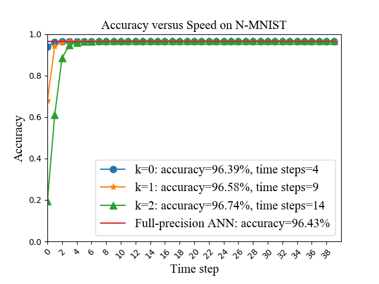
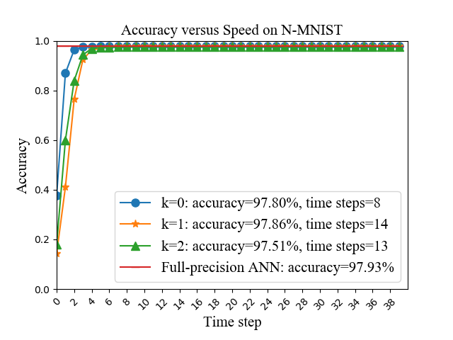
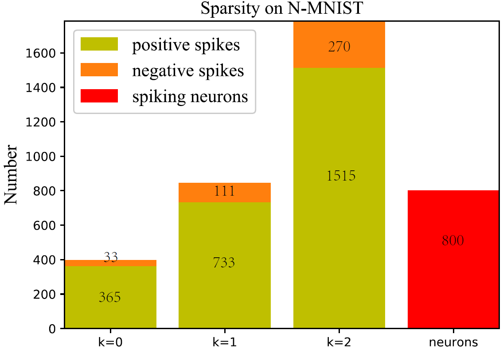
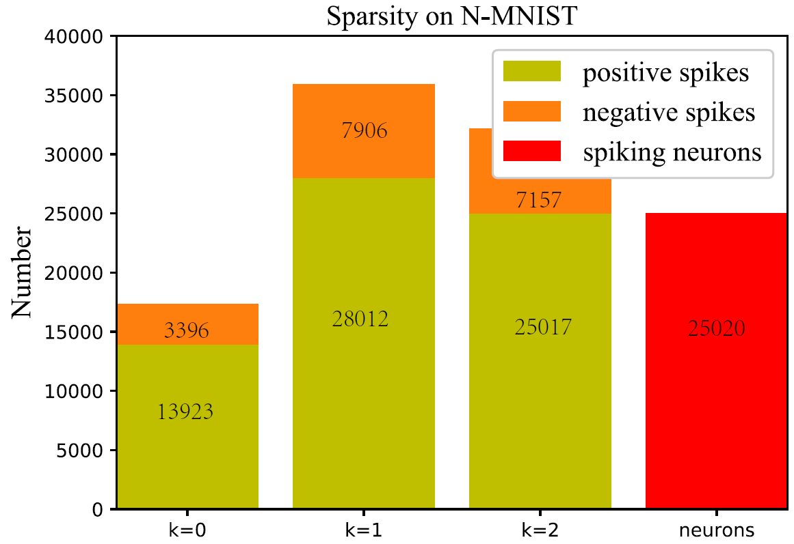
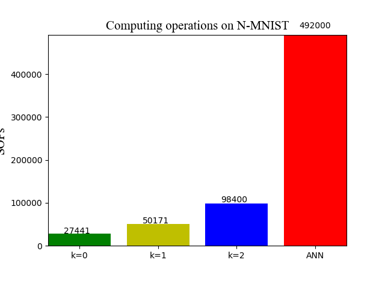
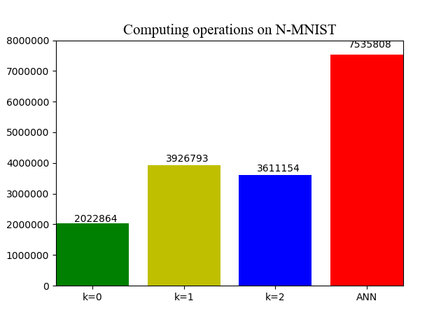

# Instructions for running N-MNIST experiments


## File overview:

- `README_N_MNIST.md` - this readme file for N-MNIST.<br>
- `spiking_ulils.py` - the functions of spiking convolution and linear.<br>
- `preprocessing_N_MNIST.py` - the preprocessing script for N-MNIST, please download the [N-MNIST dataset](https://www.garrickorchard.com/datasets/n-mnist) in advance.<br>
- `figs` - the visualization folder for SNN performance.<br>
  - `accuracy_speed.py` - the accuracy versus speed script for `spiking LeNet` and `spiking MLP` with different quantization precisions on N-MNIST<br>
  - `sops.py` - the computing operations script for `spiking LeNet` and `spiking MLP` with different quantization precisions on N-MNIST
  - `sparsity.py` - the spike sparsity script for `spiking LeNet` and `spiking MLP` with different quantization precisions on N-MNIST<br>
- `LeNet` - LeNet for N-MNIST.<br>
  - `tensorlayer` - our provided tensorlayer package.<br>
  - `training_k0_lenet_N_MNIST.py` - the training script for `LeNet` with quantization precision *`k=0`* on N-MNIST<br>
  - `training_k1_lenet_N_MNIST.py` - the training script for `LeNet` with quantization precision *`k=1`* on N-MNIST.<br>
  - `training_k2_lenet_N_MNIST.py` - the training script for `LeNet` with quantization precision *`k=2`* on N-MNIST<br>
  - `inference_k0_lenet_N_MNIST.py` - the evaluation script for `LeNet` with quantization precision *`k=0`* on N-MNIST<br>
  - `inference_k1_lenet_N_MNIST.py` - the evaluation script for `LeNet` with quantization precision *`k=1`* on N-MNIST<br>
  - `inference_k2_lenet_N_MNIST.py` - the evaluation script for `LeNet` with quantization precision *`k=2`* on N-MNIST<br>
  - `inference_k0_slenet_N_MNIST.py` - the evaluation script for `spiking LeNet` with quantization precision *`k=0`* on N-MNIST<br>
  - `inference_k1_slenet_N_MNIST.py` - the evaluation script for `spiking LeNet` with quantization precision *`k=1`* on N-MNIST<br>
  - `inference_k2_slenet_N_MNIST.py` - the evaluation script for `spiking LeNet` with quantization precision *`k=2`* on N-MNIST<br>
  - `training_full_lenet_N_MNIST.py` - the training script for `LeNet` with `full precision (float32)` on N-MNIST<br>
  - `inference_full_lenet_N_MNIST.py` - the evaluation script for `LeNet` with `full precision (float32)` on N-MNIST<br>

- `MLP` - MLP for N-MNIST.<br>
  - `tensorlayer` - our provided tensorlayer package.<br>
  - `training_k0_mlp_N_MNIST.py` - the training script for `MLP` with quantization precision *`k=0`* on N-MNIST.<br>
  - `training_k1_mlp_N_MNIST.py` - the training script for `MLP` with quantization precision *`k=1`* on N-MNIST..<br>
  - `training_k2_mlp_N_MNIST.py` - the training script for `MLP` with quantization precision *`k=2`* on N-MNIST<br>
  - `inference_k0_mlp_N_MNIST.py` - the evaluation script for `MLP` with quantization precision *`k=0`* on N-MNIST<br>
  - `inference_k1_mlp_N_MNIST.py` - the evaluation script for `MLP` with quantization precision *`k=1`* on N-MNIST<br>
  - `inference_k2_mlp_N_MNIST.py` - the evaluation script for `MLP` with quantization precision *`k=2`* on N-MNIST<br>
  - `inference_k0_smlp_N_MNIST.py` - the evaluation script for `spiking MLP` with quantization precision *`k=0`* on N-MNIST<br>
  - `inference_k1_smlp_N_MNIST.py` - the evaluation script for `spiking MLP` with quantization precision *`k=1`* on N-MNIST<br>
  - `inference_k2_smlp_N_MNIST.py` - the evaluation script for `spiking MLP` with quantization precision *`k=2`* on N-MNIST<br>
  - `training_full_mlp_N_MNIST.py` - the training script for `MLP` with `full precision (float32)` on N-MNIST<br>
  - `inference_full_mlp_N_MNIST.py` - the evaluation script for `MLP` with `full precision (float32)` on N-MNIST<br>  


## ANN Training
### Before running
* Please note your default dataset folder will be ./data [data](https://github.com/stonezwr/TSSL-BP/tree/master/Networks)

### Run the code
for example:
```sh
$ python training_k0_lenet_N_MNIST.py
```
finally, it will generate the corresponding model files including: `checkpoint`, `model_n_mnist_advanced.ckpt.data-00000-of-00001`, `model_n_mnist_advanced.ckpt.index`, `model_n_mnist_advanced.ckpt.meta` and `model_n_mnist.npz`.

## ANN Inference
### Run the code
for example:
```sh
$ python inference_k0_lenet_N_MNIST.py
```
Then, it will print the corresponding ANN test accuracy.

## SNN inference
### Run the code
for example:
```sh
$ python inference_k0_slenet_N_MNIST.py
```
Then, it will generate the corresponding log files including: `accuracy.txt`, `sop_num.txt`, `spike_collect.txt` and `spike_num.txt`.

## Visualization

for example:
```sh
$ move SNN_accuracy.txt ./figs
$ python accuracy_speed.py
```
Then, it will show the visualization results for SNN.

## Results
Our proposed method achieves the following performance on :

### N-MNIST
| Quantization Level  | Network Size  | Epochs | ANN | SNN | Time Steps |
| ------------------ |---------------- | -------------- | ------------- | ------------- | ------------- |
| Full-precision | 400-400 |   150   |  96.43% | N/A | N/A |
| k=1 | 400-400 |   150   |  96.58% | 96.58% |  9 |
| Full-precision | 12C5-P2-64C5-P2 |   150   |  97.93% | N/A | N/A |
| k=1 | 12C5-P2-64C5-P2 |   150   |  97.86% | 97.86% |  14 |

### Accuracy versus speed
MLP: 400-400<br>
LeNet: 32C5-P2-64C5-P2-1024
<figure class="half">
    
    
</figure>

### Firing sparsity
MLP and LeNet
<figure class="half">
    
    
</figure>

### Computing operations
MLP and LeNet
<figure class="half">
    
    
</figure>

## Notes
* We do not consider the synaptic operations in the input encoding layer and the spike outputs in the last classification layer (membrane potential accumulation instead) for both original ANN counterparts and converted SNNs.<br>
* We also provide some scripts for visualization in ./figs, please move `SNN_accuracy.txt`, `sop_num.txt`, `spike_collect.txt` and `spike_num.txt` to this folder and directly run the scripts.


## More question:<br>
- There might be a little difference of results for multiple training repetitions, because of the randomization. 
- Please feel free to reach out here or email: xxx@xxx, if you have any questions or difficulties. I'm happy to help guide you.
