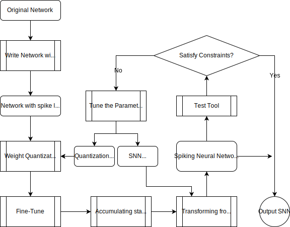

# ANN to SNN tool
This is a tool for transferring ANN to SNN.
It supports low-precision quantization of network weights.
The tool supports the networks with convolution layer,
linear layer and average pooling layer.

## Requirements
* Python >=3.5
* pytorch >=1.7.0
* torchvision
* GPUtil
* onnx

## Updating
V1.6 2021.1.8
- 新的转化策略（使用bias对spike进行修正）
- 支持torch.add操作，使用SpikeAdd层进行实现

V1.5.1 2020.12.29
- 支持卷积层的bias

V1.5
- [x] BatchNorm的支持，使用SpikeConvBN层

V1.4
- [x] Supporting SpikeConvTranspose2d
- [x] SNNTransformer framework
- [x] Supporting the COCO dataset
- [x] Supporting setting some layers as the SNN, leaving the other layers as original ANN.
- [x] Improving accuracy with more accurate Vthr.

V1.3
- 实现新的层的转化支持：
- 在spike_layers.py里面增加对应的SpikeLayer
- 在ann_parser.py里面增加相应层的转换
- 在snn_transformer.py里面增加SNN的weight转换逻辑

## Constraints
### Hardware v1.0
For Hardware v1.0, the input channel size of the convolution
in the network
must meet the following constraints.
* 3x3 kernel
  * 1bit in_channels<=113
  * 2bit in_channels<=56
  * 3bit in_channels<=37
  * 4bit in_channels<=28
* 5x5 kernel
  * 1bit in_channels<=40
  * 2bit in_channels<=20
  * 3bit in_channels<=13
  * 4bit in_channels<=10

The convolutional layers in the ANN must
take the ReLU activations function after it.

The final Fully connect layer and softmax layer will
not be transformed.

## Usage
The overall transform process is demonstrated in the following picture

<div align=center>


</div>

There is a example at ann2snn.py.

### Example Network

```shell
$ python3 ann2snn.py example_net  --weight_bitwidth 4 --timesteps 16 --finetune_epochs 30 --ann_weight checkpoint/example_net_ann.pth --save_file out_snn.pth
```

The arguments here are:
positional arguments:
*  net_name              network name to train

optional arguments:
*  --ann_weight ANN_WEIGHT
                        the location of the trained weights
*  --dataset DATASET     the location of the dataset
*  --num_workers NUM_WORKERS
                        number of workers for dataset
*  --save_file SAVE_FILE
                        the output location of the transferred weights
*  --batch_size BATCH_SIZE
*  --test_batch_size TEST_BATCH_SIZE
*  --timesteps TIMESTEPS
*  --reset_mode {zero,subtraction}
*  --weight_bitwidth WEIGHT_BITWIDTH
                        weight quantization bitwidth
*  --finetune_lr FINETUNE_LR
                        finetune learning rate
*  --finetune_epochs FINETUNE_EPOCHS
                        finetune epochs
*  --finetune_wd FINETUNE_WD
                        finetune weight decay
*  --finetune_momentum FINETUNE_MOMENTUM
                        finetune momentum

### DebugNet
```
python3 ann2snn.py debug_net0 -e 0 --dataset debug0
python3 ann2snn.py debug_net1 -e 0 --dataset debug0
python3 ann2snn.py debug_net2 -e 0 --dataset debug1
python3 ann2snn.py debug_net3 -e 0 --dataset debug2
```

### Self-defined network
You can transform your own network by adding your own network builder into `ANN2SNN/build_network.py`.

### dataset
The datasets.py contains the dataloader for MNIST and CIFAR10/100.

If other dataset is used,
the corresponding dataloader should be defined in the datasets.py

### Weight quantization
The weight quantization module is located in quantization.py.
You can use the `quantization.quantize_finetune` to quantize and finetune the network.

```python3
qnet=quantize_finetune(raw_net,trainloader,criterion,device,args)
```

The quantized network is returned, then we can test its (ANN) accuracy
by using the validate_ann in validate.py module.

```python3
qnet_top1,qnet_loss=validate_ann(qnet,test_loader,device,criterion)
```

### Transform quantized ANN to SNN
The transformation module is located in snn_weight_setter.py.
You can use the `snn_weight_setter.trans_ann2snn_weight` to transform the quantized network.

```python3
snn=trans_ann2snn_weight(qnet,train_val_loader,device,args.timesteps,args.weight_bitwidth)
```

The SNN network is returned, then we can test its (SNN) accuracy
by using the validate_snn in validate.py module.

```python3
snn_top1,snn_loss=validate_snn(snn,test_loader,device,criterion,args.timesteps)
```

### Save the SNN
Finally, the SNN can be saved in the `.pth` file.
```python3
torch.save(snn,args.save_file)
print("Save the SNN in {}".format(args.save_file))
```

# Error Analysis

There is a tool for analyse the error of quantization and spike transform.

### Requirement
* seaborn
* matplotlib

### Usage
As a example, we analyse the example_net as follows:
```shell
$ python3 analyse_error.py --load checkpoint/example_net_ann.pth example_net --finetune_epochs 10
```

# Details of Modules
- net -- parse_ann_model() -->  dag_net
- dag_net -- quantize_finetune() --> qnet
- qnet -- trans_ann2snn_weight() --> snn

## validation
The validation function located at `validation.py`, which has the following features:
- Record the `firing_ratio`
  - Switch on the global variable `firing_ratio_record` in `spike_tensor.py`
  - save the firing ratio to the global variable `firing_ratios` when a SpikeTensor is created
  - record and clear the `firing_ratios` after each iteration
  - Switch off the `firing_ratio_record` at the end of the validation

## ANN parser
The ANN parser parse an given nn.Module and generate an new SpikeDAGModule 
which consists the SpikeLayer and the computation DAG.
- conv2d -> SpikeConv
- linear -> SpikeLinear
- relu -> SpikeReLU
- avg_pool2d -> depth-wise SpikeConv with each weight set as 1/(kernel_size**2)

Steps
- wrap the functions in torch.nn.functions.
  - change all the in-place operations to out-place operations
  - the outputs are saved into the `nodes` dict in SpikeDAGModule
  - an corresponding SpikeLayer is generated and saved into the `ops` dict in SpikeDAGModule with the name of input nodes and output nodes
    - if a input node is not in `nodes`, raise an Error
  - the wrapped functions are saved into dict `wrapped_functions` containing key `new_function` and value `(function_pointer, new_function)`
- wrap Tensor to support the `.view`, `__add__` and so on
- forward the mode to get the SpikeDAGModule
  - find in_nodes keys
  - set op
  - forward the raw function
  - set out_nodes
  - save the op dict in dag.ops
  - save the output in dag.nodes
- unwrap the functions
- unwrap the Tensor
- clear the values of `nodes` in SpikeDAGModule to `None`
- return the new SpikeDAGModule

## SpikeDAGModule
This is a module contains `nodes` dict and `ops` dict. It can do inference under the topological ordering of the ops given the input nodes.
- Attributes
  - `nodes` OrderedDict, in which the key is the name of the input (`<op_name>_out<id>`)
  - `ops` OrderedDict, in which the key is the name of the op (`<op_type><id>`) and the value is a dict `{'op':op, 'in_nodes':tuple, 'out_nodes':tuple}`
  - `inputs_nodes` tuple, specifying the input nodes for forward
- forward
  - copy the inputs to nodes in `inputs_nodes`
  - for `op` in `ops`:
    - get inputs from `nodes`
    - forward `op`
    - save outputs to `nodes`

## quantize_finetune
The quantization.py provide the symmetric quantization for ANN.
- init_quantize_net()
  - for each `weight` Variable, set the `weight.weight_back`
- quantize_train()
  - forward and backward using `weight.data`
  - a QuantSGD optimizer that update `weight.weight_back` using the gradient
  - quantize_layers()
    - for each layer, quantize the `weight.data` according to `weight.weight_back`
After quantization
- all the weight is `quantized_w/scale`. NOTICE the weight are rescale back.


## snn_weight_setter.py
The snn_weight_setter.py transform the weight of ann to snn.
- for every SpikeConv2d & Spike Linear in net.modules:
  - warp_spike_layer()
    - save the pointer of `forward` function to `layer.old_forward`
    - set the `forward` function to a wrapped function
    - each layer's input is saved in a global dict `input_pool` at forward
    - each layer's output is saved in a global dict `output_pool` at forward
- forward some samples to generate the DAGModule
- unwrap the layers
  - reset the `forward` function to `layer.old_forward`
- `set_weight_Vthr` for each layer except the first
  - weight is quantized and get the scale_factor `s_w`
  - get max of top 99.9% input `max_i` (random select 1M elements from pool for acceleration)
  - get max of top 99.9% output `max_o`
  - calculate the Vthr `Vthr=max_o/max_i*s_w`
- `set_Vthr_first_layer`
  - `Vthr=max_o/timesteps`
- set reset_mode in each layer in DAGModule


# SNNTransformer 预想的使用方法

1.在任意工程里面实例化SNNTransformer
```
t=SNNTransformer(full_net, need_to_transfer_layers_list)
```
可以设置need_to_transfer_layers_list，list内的网络会被转化成SNN，其它部分保持ANN模式。注意：列表内的网络层必须是连续的

2.训练的for循环，采用使用者自己的工程trainloader和criterion，transformer内维护一个optimizer
```
for inputs,targets in trainloader:
  output=transformer.inference_get_status(inputs)
  loss=criterion(output,targets)
  loss.backward()
  transformer.optimizer.step()
```

3.生成ann-snn混合网络用作validation，调用使用者自己的工程validator进行测试
```
ann_snn=transformer.generate_ann_snn()
performance=validator(ann_snn,testloader,...)
```

4.生成snn网络，保存下来送到工具链下一步处理；同时保存一些测试snn的输入测试用例
```
transformer.save_snn(direction)
```
